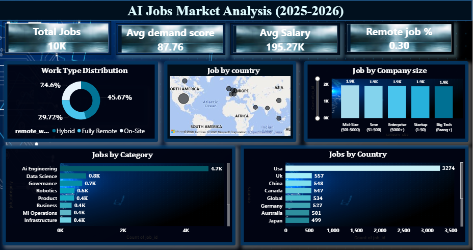
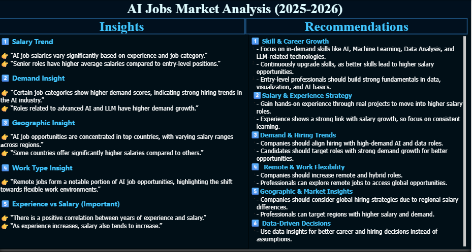

# AI Jobs Market Analysis Dashboard (Power BI)

## 📊 Project Overview
This project analyzes AI job market trends (2025–2026) using Power BI ,including salary, demand, and experience insights.

## 🛠️ Tools Used
- Power BI  
- Excel  

## 📈 Key Insights
- Salary increases with experience  
- AI job demand is growing  
- Remote jobs are increasing  

## 💡 Recommendations
- Focus on high-demand skills  
- Gain experience for higher salary  
- Companies should adopt remote hiring  

## 📷 Dashboard

