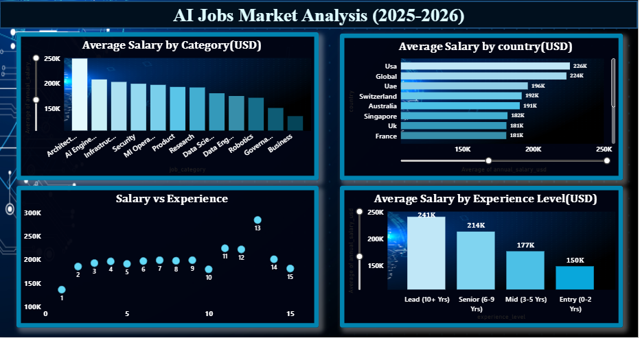

# AI Job Market Analysis 2025–26

## 📌 Project Overview
This project analyzes global AI and Data job market trends using real-world job listing data.

Goal: Identify in-demand roles, required skills, salary trends, and remote work opportunities to help job seekers understand the AI job market.

---

## 🛠 Tools & Technologies
- Kaggle Dataset
- Python (Data Cleaning Tool)
- Power BI (Dashboard & Visualization)
  

---

## ⚙️ Workflow
1. Collected raw dataset from Kaggle
2. Cleaned dataset using a Python GUI tool
3. Imported cleaned data into Power BI
4. Built an interactive dashboard (3 pages, 9 visuals)
5. Generated career recommendations based on insights

---

## 📊 Dashboard Preview

### Overview Page

### Salary Analysis

### Recommendation Page

---

## 🔍 Key Insights
- Most in-demand AI/Data job roles identified
- Salary trends analyzed by country, category, and experience
- Remote job distribution explored
- Salary vs experience relationship visualized
- Career recommendations provided based on market demand

---

## 🎯 Project Outcome
This project demonstrates an end-to-end data analytics workflow:
Data Cleaning → Analysis → Visualization → Business Recommendations.
